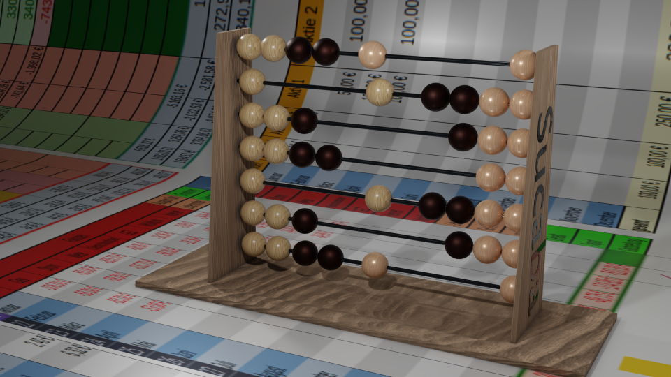
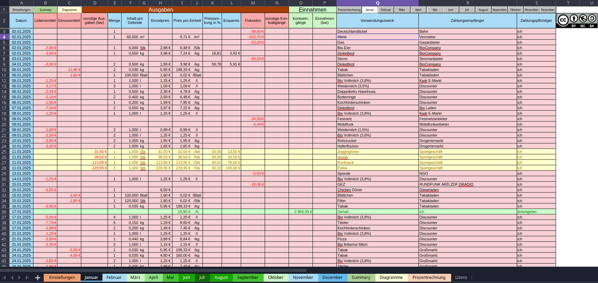
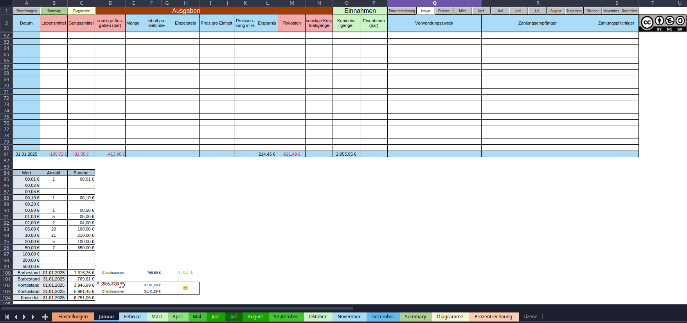
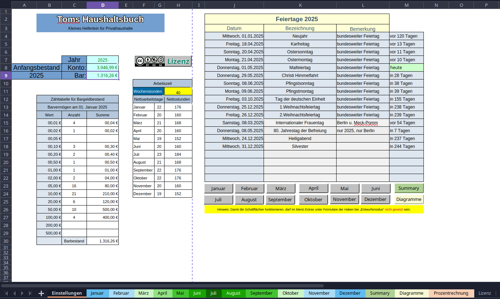
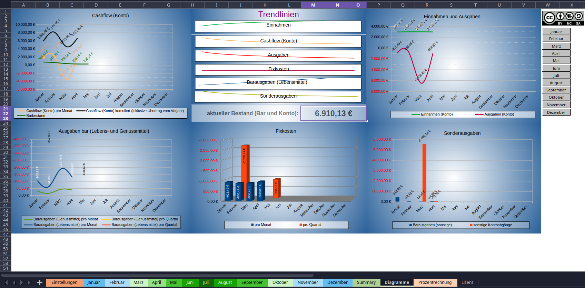

# Toms Haushaltsbuch

# 📊 Haushaltsbuch für LibreOffice Calc

Ein vollständiges Haushaltsbuch für Privathaushalte – ohne Makros, ohne komplizierte Technik, aber mit jeder Menge Features.
Entwickelt, um den Überblick über Einnahmen, Ausgaben und Ersparnisse zu behalten – und das ganze Jahr im Blick zu haben.
---
## Inhaltsverzeichnis

- [Zielgruppe](#zielgruppe)
- [Funktionen und Features](#funktionen-und-features)
- [Struktur](#struktur)
- [Hinweise zur Benutzung](#hinweise-zur-benutzung)
- [Screenshots](#screenshots)
- [Bekannte Stolperfallen](#bekannte-stolperfallen)
- [Anpassung & Erweiterung](#anpassung--erweiterung)
- [To-Do](#to-do)
- [Lizenz](#lizenz)

---

## 🧑‍💻 Zielgruppe

Dieses Tool richtet sich an:
- Privatpersonen & Haushalte mit **bis zu 80 Transaktionen pro Monat**
- Leute, die **keine Lust auf Apps oder Cloud-Lösungen** haben (Deine Daten gehören nur Dir, auch Deine Einkaufsliste)
- Menschen mit grundlegenden Kenntnissen in Tabellenkalkulation
- Alle, die ihre **Finanzen einfach, visuell und nachvollziehbar** verwalten wollen

---

## ✨ Funktionen und Features

- 
- ✅ 12 Monatsblätter mit farblicher Markierung von Einnahmen und Ausgaben
- ✅ Übersicht (Sheet Jahresüberblick) mit Möglichkeit zur Anzeige einzelner Kategorien und Trenddarstellung (teilweise)
- ✅ Dynamische Diagramme im Sheet Diagramme plus Trendlinien für wichtige Kenngrößen
- ✅ Dynamische Datumsanzeigen:&nbsp; in Zelle A2 jeder monatlichen Tabelle zur Erfassung der Transaktionen/Einkäufe etc. werden Infomationen mit Datumsbezug dynamisch angezeigt:
  - wenn der Monat in der Vergangenheit liegt, erscheint der Text "Monatsende erreicht"
  - wenn der Monat der aktuelle ist, wird das aktuelle (System-)Datum angezeigt
  - wenn der Monat in der Zukunft liegt, wird angezeigt, wieviel Tage es noch bis zum Monatsbeginn sind
- ✅ Anzeige eines Budget: wenn Transaktionen mit einem zukünftigen Datum eingetragen werden, z.B. vorraussichtliche Lohnzahlungen, vorraussichtliche Fixkosten (Miete, Energie, Telefon, etc), dann wird aus diesen zukünftigen Ein- und Ausgaben (Zeile 82 "vorgemerkt") ein Budget errechnet (Zelle J82), das täglich aktualisiert wird und mit den variablen Ausgaben (Lebensmittel, Genussmittel, sonstige Ausgaben) verrechnet wird. Am der am Monatsende verbleibende Betrag wird als Sparbetrag in der Zelle Jahresüberblick.S15 kumuliert. Ein kleines Diagramm darunter zeigt den bisherigen Sparverlauf für das aktuelle Jahr.
- ✅ Zusätzliche Berechnungen wie (Netto-)Stundenlohn, Einzelpreis oder Ersparnis bei Rabatt-Käufen (Hinweistext zu Zelle Einstellungen.H11 beachten, um eine korrekte Berechnung zu gewährleisten)
- ✅ Extra-Sheet als Rechenhilfe für Prozentrechnung (Rabatt-Berechnung). Mit Erklärung und Grundformel. Werte eintragen - fertig.
- ✅ Eingabeschutz für Formeln (kein Passwort nötig)
- ✅ Smiley-Stimmungsbarometer zur finanziellen Lage
- ✅ Funktioniert vollständig offline in LibreOffice Calc
- ✅ Keine Makros, keine Cloud, keine Drittanbieter-Dienste

---

## 📂 Struktur

- **Sheet Einstellungen:** Jahreszahl, Startwerte, Feiertage, Wochenstunden
- **Sheets Monate:** `Januar`, `Februar`, ..., `Dezember` – für Transaktionen und Erfassung des Bargeldbestands
- **Sheet Summary:** Jahresüberblick inklusive Kategorientracking, Trendanalyse für bestimmte Kategorien und Anzeige des Finanzstatus (Konto u. Bargeld)
- **Sheet Diagramme:** Visualisierung des Verlaufs von Einnahmen, Ausgaben etc.
- **Sheet Prozentrechnung:** Tool zur Rabatt-Berechnung
- **Sheet Hinweise:** Alle Hinweistexte (Zellenkommentare) aller Tabellen zum Nachlesen in einem Sheet

---

## 📌 Hinweise zur Benutzung

- beste Darstellung bei einer Auflösung von 1980x1080 (Standard-Monitorgröße für Desktop-PCs)
- **Formeln nicht überschreiben!** Geschützte Zellen zeigen das durch einen Zellschutz an. Der Schutz kann entfernt werden, ist aber nicht passwortgesichert.
- Kategorien werden über die Spalte `Verwendungszweck` erkannt. Beispiel: Ein Eintrag wie `Gehalt März` zählt zur Kategorie `Gehalt`, wenn diese im Sheet `Summary` festgelegt ist.
- Das aktuelle Datum wird in zukünftigen Monaten bis zum Monatsende automatisch angezeigt. Ist das Monatsende erreicht bleibt es beim Datum des letzten Tags des jeweiligen Monats stehen.
- Für die korrekte Anzeige der Smileys brauchst du die Schriftart [`DroidSansMono Nerd Font`](https://www.nerdfonts.com/font-downloads) [`direkter Download`](https://github.com/ryanoasis/nerd-fonts/releases/download/v3.4.0/DroidSansMono.zip), ansonsten werden lediglich Unicode-Smileys angezeigt.

---

## 🖼️ Screenshots

| Monatsblatt | Einstellungen | Summary | Diagramme |
|-------------|---------------|---------|-----------|
|   |  |  |  |

---

## ⚠️ Bekannte Stolperfallen

| Problem | Erklärung |
|-----------|-----------|
| Kategorien werden nicht erkannt | Stichwort fehlt im Verwendungszweck oder die Schreibweise ist nicht identisch. |
| Smileys sind kryptisch | Nerd Font fehlt. [`DroidSansMono Nerd Font`](https://www.nerdfonts.com/font-downloads) |
| Zellen „meckern“ oder sehen komisch aus | Wurden versehentlich Formeln geändert oder gelöscht? Manche Formeln sind [Matrix-Formeln](https://help.libreoffice.org/latest/de/text/scalc/guide/matrixformula.html) (eine geschweifte Klammer {...} um die Formel zeigt dies an). Ohne diese Markierung als Matrix-Formel funktionieren diese Formeln nicht und geben eine Fehlermeldung aus. Es reicht übrigens nicht, einfach die geschweiften Klammern manuell einzufügen. |
| Eingetragene Werte werden nicht in die Berechnung einbezogen | Das kann mehrere Ursachen haben. Entweder liegt das Datum der Buchung in der Zukunft oder es wurde kein Datum eingetragen oder der Eintrag ist in der falschen Spalte (z.B. ein negativer Wert bei *Einkünften*). |
| Neue Monate hinzufügen? | Nicht nötig – alles ist bereits für das ganze Jahr vorbereitet. |
| Warum wird in zukünftigen Monaten in manchen Zellen das heutige Datum angezeigt? | Das Datum in einigen Zellen wird automatisch aktualisiert. Ist das jeweilige Monatsende erreicht bleibt es beim Datum des letzten Tags des betreffenden Monats stehen. Hintergrund: Einträge werden - auch im aktuellen Monat - nur bis *HEUTE* ausgewertet. D.h., wenn Einträge vorgenommen werden, deren Datum in der Zukunft liegt, werden diese Einträge nicht mit berechnet. So sieht man immer den aktuellen Stand der Finanzen, ohne zukünftige Ausgaben bzw. Einnahmen. Zukünftige Einnahmen und Ausgaben fließen in die monatlichen Budget-Berechnung mit ein, jedoch zeigen diese sich nicht in der Jahresübersicht und auch nicht in den Diagrammen. |
| Zu wenige Zeilen im Monat? | Zeilen können hinzugefügt werden, aber die Formeln müssen ergänzt werden. |
| Änderungsversuche werden nicht akzeptiert | Die Sheets sind zum Schutz der Formeln geschützt, der Schutz kann jedoch leicht aufgehoben werden. Das Passwort ist leer. |

---

## 🛠️ Anpassung & Erweiterung

Wer mehr Transaktionen oder Spezialfunktionen braucht, sollte sich ein wenig mit LibreOffice Calc auskennen (z. B. Zellbezüge, Zellschutz und bedingte Formatierung). Dann können in dem gewünschten Monat neue Zeilen hinzugefügt werden. Dabei ist zu beachten, dass die Formeln in der ganzen Zeile entsprechend ergänzt werden müssen. Wie gesagt: Grundkenntnisse in LibreCalc sind in dem Fall äußerst hilfreich.

---
## 📝 To-Do
- ?
- become rich
- take over the world

---

## 📜 Lizenz

*Namensnennung-Nicht kommerziell-Share Alike 4.0 International (by-nc-sa)*

[`https://creativecommons.org/licenses/by-nc-sa/4.0/deed.de`](https://creativecommons.org/licenses/by-nc-sa/4.0/deed.de)

